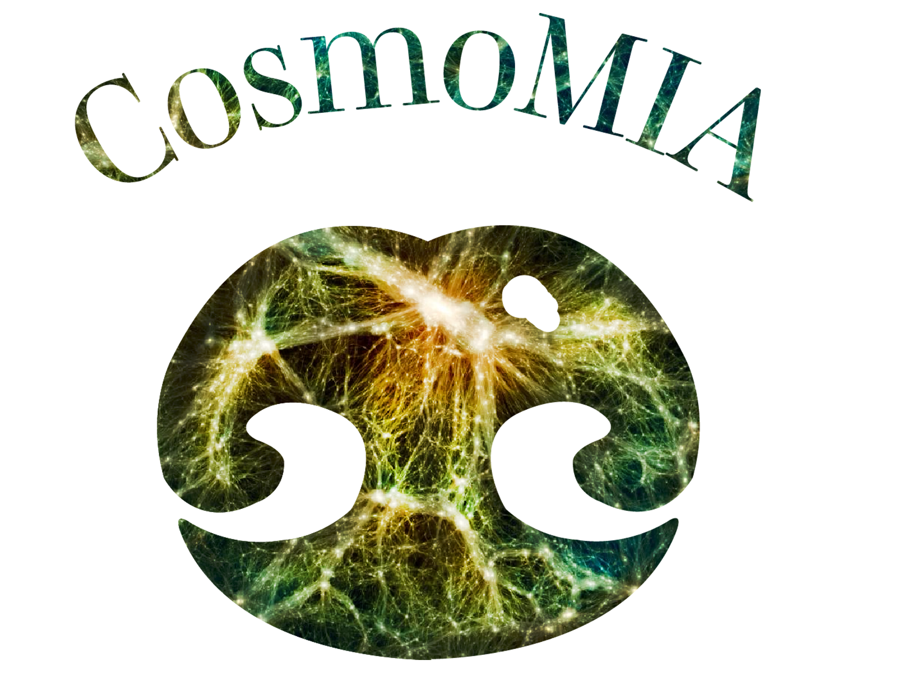

# CosmoMIA

[](https://github.com/dforero0896/CosmoMIA.jl/actions/workflows/CI.yml?query=branch%3Amain)


The **Cosmo**logical **M**ultiscale **I**nfall **A**lgorithm is developed to overcome the limitations of low resolution yet fast cosmological simulations, which are unable to resolve the clustering below the mesh resolution used to compute the evolved dark matter field. It does so by 1. Placing galaxy tracers using the available dark matter particles, 2. cleverly placing randomly sampled particles as required and 3. a 2-step collapse model that takes into account the cosmic web environment of each particle in order to tune the pairwise positions in order to better match the small scale clustering of the reference. Full details of the method can be found [here](https://arxiv.org/abs/2402.17581).

If you use this code in a scientific publication please cite the following paper.
```
@ARTICLE{2024arXiv240217581F,
       author = {{Forero-S{\'a}nchez}, Daniel and {Kitaura}, Francisco-Shu and {Sinigaglia}, Francesco and {Mar{\'\i}a Coloma-Nodal}, Jose and {Kneib}, Jean-Paul},
        title = "{CosmoMIA: Cosmic Web-based redshift space halo distribution}",
      journal = {arXiv e-prints},
     keywords = {Astrophysics - Cosmology and Nongalactic Astrophysics},
         year = 2024,
        month = feb,
          eid = {arXiv:2402.17581},
        pages = {arXiv:2402.17581},
          doi = {10.48550/arXiv.2402.17581},
archivePrefix = {arXiv},
       eprint = {2402.17581},
 primaryClass = {astro-ph.CO},
       adsurl = {https://ui.adsabs.harvard.edu/abs/2024arXiv240217581F},
      adsnote = {Provided by the SAO/NASA Astrophysics Data System}
}
```
